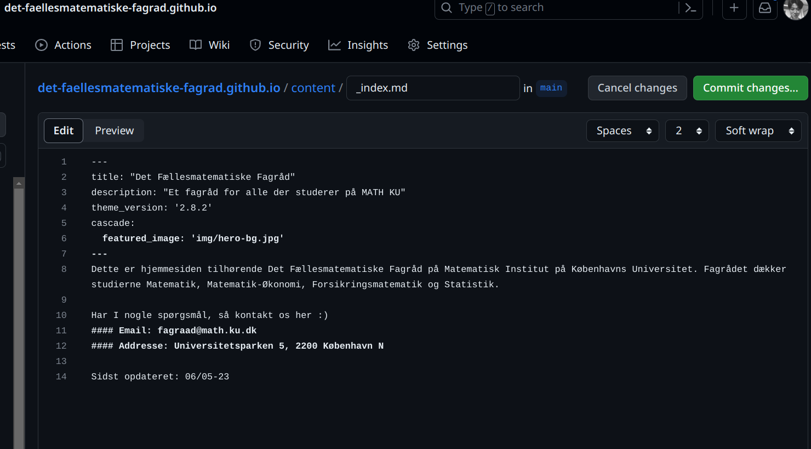

# The website for the MATH student council

This repo contains the website for the MATH student council at KU.

## Site structure

The pages for this site are located in `/content/`, each folder contains an `index.md` file which can be freely edited. The layouts for the pages are located in `/layouts/`, these layouts override from the theme. We are using the [ananke Hugo theme](https://github.com/theNewDynamic/gohugo-theme-ananke).

## Deployment

The page is hosted completely free on GitHub pages, there's a workflow action setup that automatically deploys the page when there is a new commit to the main branch. The workflow action is located in `.github/workflows/gh-pages.yml`. The workflow action builds the site and pushes the contents of the `public/` folder to GitHub pages.

## How to guides

### Editing the site

To edit the site you must have a GitHub account and be added as a collaborator to the repo. If you are not a collaborator you can make a pull request with your changes.
To register a GitHub account go to [github.com](https://github.com/signup) and create an account. Then contact an admin to be added as a collaborator.

To edit the front page, navigate to `/content/_index.md` and click the edit button in the top right corner. This will open the file in the GitHub editor. Make your changes and commit them.

To edit other pages, navigate to the page you want to edit and click the edit button in the top right corner. This will open the file in the GitHub editor. Make your changes and commit them. For example to edit the page for the revy videos, navigate to `/content/revy/index.md` and click the edit button.


Now to to the page [site](det-faellesmatematiske-fagrad.github.io) and check that your changes have been applied.

### Adding a new page

To add a new page, create a new folder under `/content/`. For example `/content/revy`. Now create an `index.md` file under the folder with the following contents (as an example)

```
---
title: "Revy videoer"
omit_header_text: true
featured_image: 'img/hero-bg.jpg'
menu:
  main:
    weight: 1
---

...
```

Between the `---` block are the parameters that specify the page:

- `title` will be the title of the page, which is also shown under the navigation menu.
- `featured_image` is the background image for the header
- `menu` controls whether the page should be showing in the navigation menu

There are other options that are available, see [ananke Hugo theme](https://github.com/theNewDynamic/gohugo-theme-ananke)

### Adding a new course video

To add a new course video to 'Kursusvideoer' simply edit `content/videos/index.md` and add a new HTML div element to the video grid.

```html
<div class="video-grid-item"></div>
```

This edit can be done through the browser, you can make a pull request or commit directly to the main branch if you are an admin.
